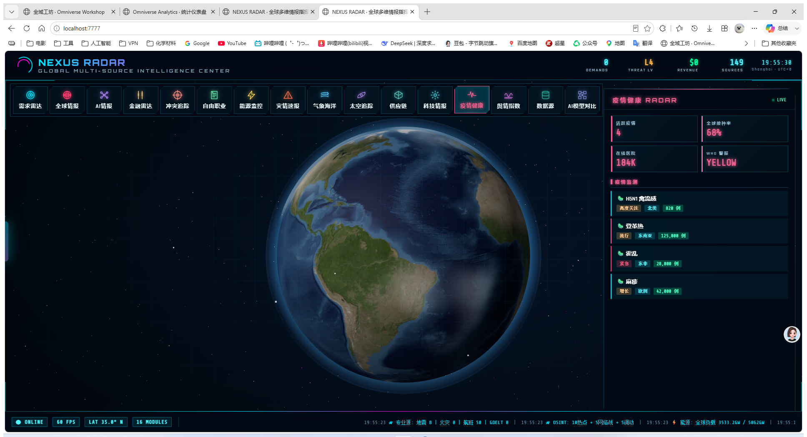

# NEXUS RADAR · 全球情报系统

> 🌍 实时3D地球可视化 + 149个全球数据源 + AI智能分析 + 16家LLM服务商支持

[](https://github.com/Kaymue-commits/ai-autonomy-platform/releases/latest)
[](#)
[](#)
[](https://threejs.org/)



## 📊 核心模块

| 模块 | 功能 | 数据源 |
|------|------|--------|
| 🎯 **需求雷达** | 全球自由职业机会 + 预算估算 | WeWorkRemotely/RemoteOK/HN Jobs/电鸭社区 |
| 🌍 **全球情报** | 地缘政治事件 + CII指数 | GDELT/ACLED/USGS/FIRMS |
| 🤖 **AI情报** | AI论文 + GitHub Trending + AI新闻 | arXiv/GitHub/TechCrunch |
| 💰 **金融雷达** | 加密货币 + 股指 + AI-Trader | CoinGecko/Yahoo Finance |
| 🛰 **太空监测** | 398颗卫星实时位置(含Starlink) | CelesTrack TLE API |
| ⚡ **能源监控** | 全球电网 + 水电/核电/光伏/天然气 | IEA/ENTSO-E |
| 🌦 **气象海洋** | 动态云层 + 台风/气旋可视化 | NOAA/GFS |
| 🔧 **科技情报** | 全球科技热点实时追踪 | TechCrunch/TheVerge/36氪/HN |

## 🤖 AI 助手特性

- **16家LLM服务商支持**: OpenAI/DeepSeek/Anthropic/Gemini/MiniMax/通义千问/智谱/Kimi/Grok/Groq/Mistral/Together/OpenRouter/SiliconFlow/百川/零一万物
- **13个智能工具**: 赚钱机会分析、威胁评估、金融查询、卫星追踪、能源监控等
- **自动降级机制**: 工具调用失败时自动尝试纯对话模式
- **语音控制**: 全系统语音操控（切换模块、调节语速、打开设置等）

## 📊 实时状态
- 149个全球数据源自动聚合
- AI需求自动评分（0-100分 + USD价值估算）
- 自动对接（Discord/企业微信/邮件）
- 自动开发（LLM生成技术方案 + 代码骨架）
- 跨境收款（Creem 国际 + 支付宝/微信 国内）

## 🌍 实时3D地球
- Three.js 真实渲染
- NASA Blue Marble 卫星贴图（蓝绿海洋 + 大陆地形 + 山脉凹凸）
- 26 个全球城市真实经纬度定位（北美/欧洲/亚洲/中东/南美/大洋洲）
- 抓取到需求时对应城市自动脉冲扩散 + 中心连线
- 星空背景 + 大气层光晕 Shader
- 鼠标拖拽旋转 / 滚轮缩放

## 🚀 快速启动

### 1. 克隆仓库
```bash
git clone https://github.com/Kaymue-commits/ai-autonomy-platform.git
cd ai-autonomy-platform
```

### 2. 创建虚拟环境并安装依赖
```bash
python -m venv venv
source venv/Scripts/activate    # Windows Git Bash
# 或 venv\Scripts\activate     # Windows CMD
pip install -r requirements.txt
```

### 3. 启动服务
```bash
python -m uvicorn backend.main:app --host 0.0.0.0 --port 7777 --reload
```

或者 Windows 一键启动：
```bat
start.bat
```

### 4. 打开浏览器
```
http://localhost:7777
```

## 📁 项目结构
```
ai-autonomy-platform/
├── backend/                    # FastAPI 后端
│   ├── main.py                 # 主服务 (SSE 实时推送)
│   └── modules/
│       ├── contact.py          # 自动对接模块
│       ├── builder.py          # 自动开发模块
│       └── payment.py          # 跨境收款模块
├── frontend/                   # 前端
│   ├── globe.html              # 完整版（真实数据 + SSE）
│   ├── demo.html               # 静态展示版
│   ├── js/
│   │   ├── three.min.js        # Three.js 0.160
│   │   └── OrbitControls.js    # 手写鼠标控制
│   └── textures/
│       ├── earth-blue-marble.jpg    # NASA 真实地球贴图
│       ├── earth-topology.png       # 山脉凹凸
│       └── earth-water.png          # 水面反射
├── workspace/                  # 自动开发的项目落地
├── output/                     # 截图 + 日志
├── logs/                       # 对接日志 + 收款记录
├── config.json                 # 配置
├── requirements.txt
├── start.bat                   # Windows 一键启动
├── VERSION                     # 版本号
├── CHANGELOG.md                # 更新日志
└── .env.example                # 环境变量模板
```

## 🔑 配置

编辑 `config.json` 或创建 `.env`：

```json
{
  "creem_api_key": "",          // https://creem.io (国际收款)
  "alipay_app_id": "",          // 支付宝开放平台 (国内)
  "wechat_mch_id": "",          // 微信支付商户号 (国内)
  "deepseek_api_key": "",       // https://platform.deepseek.com (LLM方案生成)
  "openai_api_key": "",         // 备选 LLM
  "discord_webhook": "",        // Discord 实时推送
  "wecom_webhook": "",          // 企业微信机器人
  "contact_email": ""           // 自动外联邮箱
}
```

**不填也能跑** — 系统会用本地规则匹配 + 默认模板输出，方便先看效果。

## 📡 API 接口

| Endpoint | Method | 说明 |
|---|---|---|
| `/` | GET | 完整版 3D 地球 |
| `/static/demo.html` | GET | 静态展示版 |
| `/api/demands` | GET | 需求列表（支持 `region`、`min_score` 过滤） |
| `/api/stats` | GET | 统计数据 |
| `/api/stream` | GET | SSE 实时推送 |
| `/api/scan` | POST | 手动触发扫描 |
| `/api/contact/{id}` | POST | 自动对接某需求 |
| `/api/build/{id}` | POST | 自动开发某需求 |
| `/api/webhook/creem` | POST | Creem 收款回调 |


| `/api/feed` | GET | 聚合新闻流（149 源 + 5 variant） |
| `/api/feed/variants` | GET | 列出所有 variant 和分类 |
| `/api/sources/stats` | GET | 数据源统计 |
| `/api/aggregator` | GET | 全量并发聚合（149 源） |
| `/api/threat-levels` | GET | 威胁分级元数据 |
| `/api/events/geolocated` | GET | 带经纬度的真实事件 |
| `/api/events/gdelt` | GET | GDELT 全球事件数据库 |
| `/api/specialized` | GET | 专业数据（USGS/ACLED/FIRMS/GDELT） |
| `/api/specialized/earthquakes` | GET | 24h 地震数据 |

**v1.1.0 新增**:
- 🌐 **149 个数据源**（基于 koala73/worldmonitor 60K stars 项目）
- 🛰 **专业 API 接入**: USGS地震 / ACLED冲突 / NASA FIRMS火灾 / GDELT全球事件
- 🎯 **威胁分级系统**: critical/high/medium/low/info 5 级
- 📊 **聚合器**: 149 源并发抓取 + 缓存 + 限流
- 🗺 **变体架构**: full/tech/finance/energy/happy/intel 6 种产品定位


## 💰 商业模式

| 评分区间 | 价值估算 | 自动化策略 |
|---|---|---|
| 80-100 | $5K-$50K | 立即对接 + 报价 |
| 60-79 | $1K-$5K | 对接 + 准备方案 |
| 40-59 | $200-$1K | 仅对接 |
| <40 | <$200 | 仅记录 |

## 🛠 技术栈
- Python 3.11 + FastAPI + SQLAlchemy
- Three.js 0.160 + 原生 JS（零构建）
- Feedparser（RSS 抓取）
- httpx（异步 HTTP）
- sse-starlette（实时推送）
- APScheduler（定时任务）

## 📝 版本
当前版本：**v2.1.0**（[CHANGELOG](./CHANGELOG.md)）

### v2.1.0 更新内容
- ✅ 修复 LLM API 调用问题，MiniMax 改用 OpenAI 兼容协议
- ✅ 修复 voice_intent 语音意图识别 bug
- ✅ 统一 LLM 抽象层，builder.py 改用 llm.py
- ✅ 添加工具调用失败自动降级机制
- ✅ 过滤思考标签，回复更干净
- ✅ 16家 AI 服务商配置和切换功能

## 📜 License
MIT
